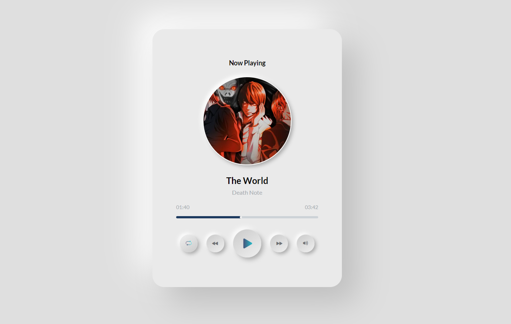

# ANIME APP PROJECT

## Tabla de Contenidos

- [ANIME APP PROJECT](#anime-app-project)
  - [Tabla de Contenidos](#tabla-de-contenidos)
  - [Preview](#preview)
    - [Screenshot](#screenshot)
  - [Proyecto](#proyecto)
    - [Links](#links)
  - [Proceso](#proceso)
    - [Construido con:](#construido-con)
    - [Recursos Utilizados](#recursos-utilizados)
  - [Autor](#autor)

## Preview

### Screenshot

## Proyecto

Reproductor de música con diseño basado en Neuromorfismo.

### Links

- Repositorio: [Solution](https://github.com/fabioalcocer/music-player-neuromorphism)
- Live Site URL: [Live App](https://music-player-neuromorphism.vercel.app/)

## Proceso

### Construido con:

- Mobile-first workflow
- Responsive Design
- Pure CSS
- Flex Layout
- React

### Recursos Utilizados

- [Cloudinary](https://cloudinary.com/)
- [Audio Web API's](https://developer.mozilla.org/en-US/docs/Web/API/HTMLAudioElement/Audio)
- [MDN Web Docs](https://developer.mozilla.org/es/docs/Web)

## Autor

- Twitter - [@fabioalcocer17](https://twitter.com/fabioalcocer17)
- LinkedIn - [@fabio-alcocer](https://www.linkedin.com/fabio-alcocer/openbootcamp-escuela/)
- GitHub - [@fabioalcocer](https://github.com/fabioalcocer/)
